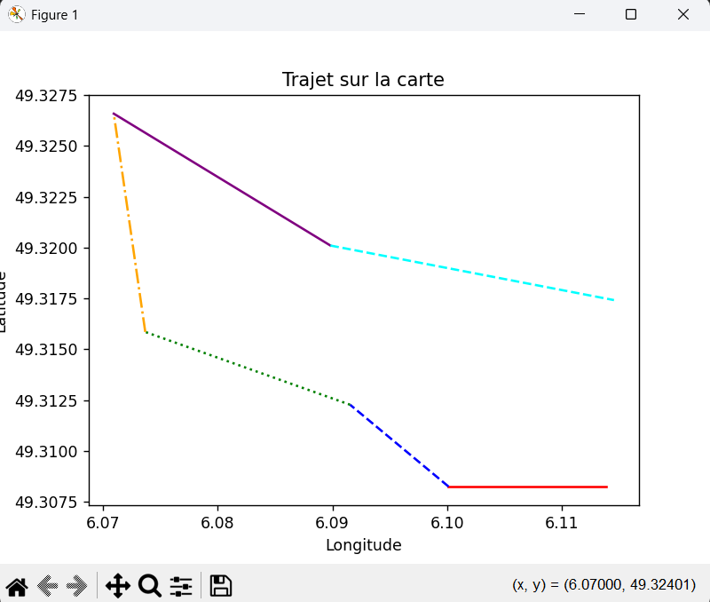

# 🌍 Geographic Data Analysis

This project analyzes **geographic data** from a `.gpx` file and provides both numerical and graphical insights.
It computes the **cumulative elevation gain**, **total distance** (as the crow flies), and visualizes the route with Matplotlib.

---

## 📸 Vizualisation of gpx file



---

## 📈Elevation Profile


---

## 🛠 Features

- **Parse GPX data** to extract:
  - Latitude
  - Longitude
  - Altitude
- **Compute statistics**:
  - Total distance (straight-line, point-to-point)
  - Cumulative positive elevation gain
- **Visualize data** with Matplotlib:
  - Altitude vs. point index
  - Altitude profile vs. real distance
  - Route visualization (lat/long)

---

## 🚀 Getting Started

### 1️⃣ Requirements

Install **Python 3.x** and **matplotlib**:

```bash
pip install matplotlib
```


### 2️⃣ Prepare Your GPX File

Place a `.gpx` file (for example `Fameck-Florange.gpx`) in the same folder as the script.


### 3️⃣ Run the Program

```bash
python main.py
```

---


## 🧩 How It Works

1. **GPX Parsing**

   The `creation_base()` function reads the GPX file and extracts latitude, longitude, and altitude from each `<trkpt>`.
2. **Calculations**

   * `denivele_cumule_positif()` → sums all positive altitude differences to compute the total climb.
   * `distance_oiseau()` → calculates the total straight-line distance between points (Haversine formula).
3. **Visualizations**

   * `graphique_altitude1()` → plots altitude vs. point index.
   * `graphique_altitude2()` → plots altitude vs. traveled distance.
   * `graphique_carte()` → plots the route on a lat/long graph.

---

## 📊 Example Results

* **Total distance:** ~4.2 km
* **Cumulative climb:** 83 m
* **Charts:**
  * Altitude profile
  * Route visualization

*(Your results will vary depending on the GPX file used.)*

---

## 🤝 Contributing

Improvements and ideas are welcome:

* Add support for more GPX metadata (time, speed).
* Export results as CSV or JSON.
* Make an interactive version with a GUI.

Pull requests are welcome! 🎉
